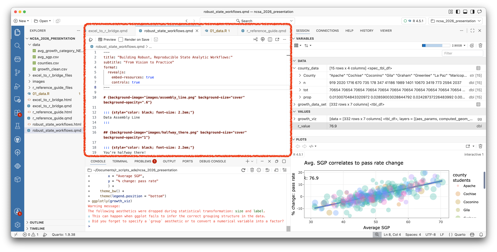
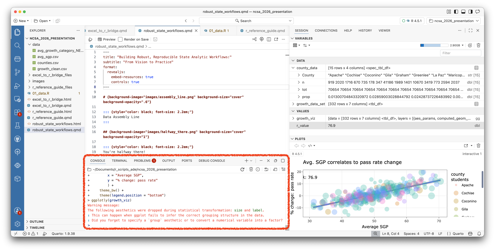
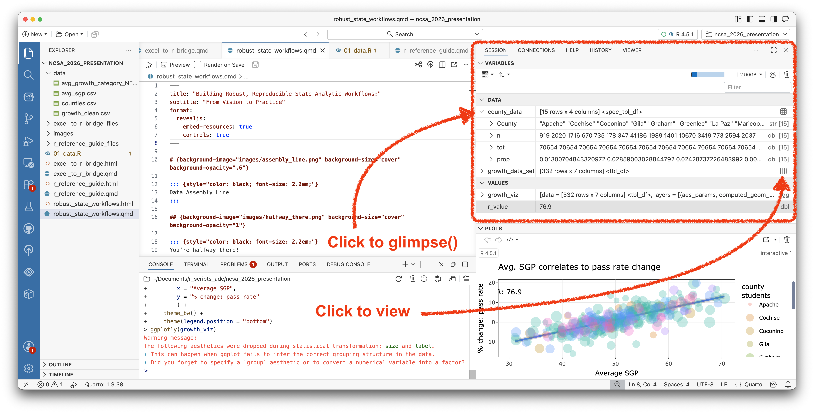
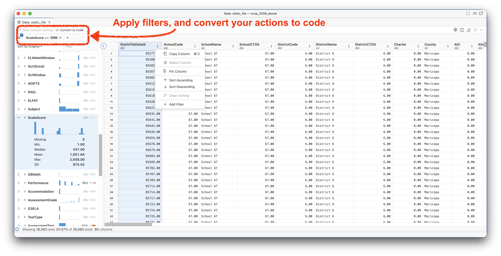
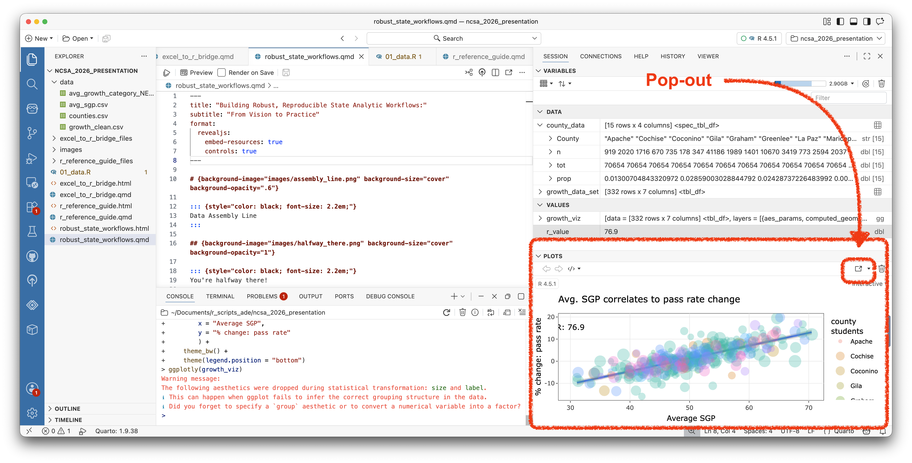
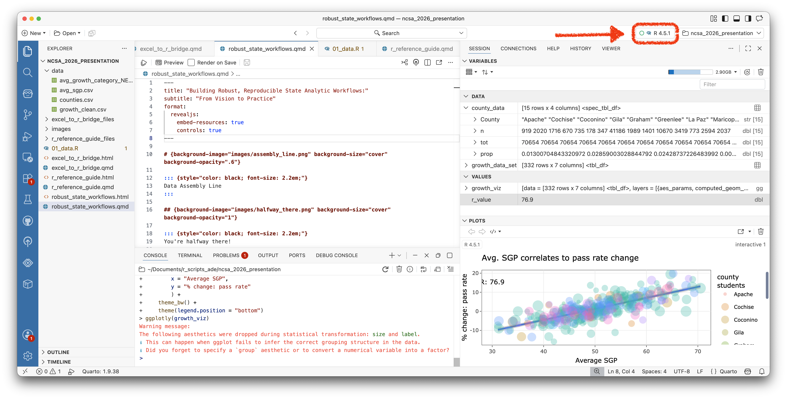

# Meet Positron {#sec-meet-positron}

## Why Positron

Positron is a relatively new IDE built specifically for data science work, and it's a strong starting point for this book for a few concrete reasons:

- **It's data-science-first**, not adapted from a general-purpose code editor after the fact — the layout and built-in panes are designed around the rhythm of working with data, looking at tables, and viewing visualizations.
- **It's R *and* Python compatible.** If you ever do pick up Python later (see the closing note in [Why R First](#sec-why-r-first)), you don't need to learn an entirely new editor — Positron handles both natively.
- **It's actively developed and current**, built and maintained by Posit, the same organization behind much of the tidyverse and Quarto tooling this book relies on throughout.
- **It will feel familiar if you've used VS Code.** Positron is built on the same underlying editor framework as Visual Studio Code, one of the most widely used code editors across all of software development. If you've ever poked around VS Code for any reason, a lot of Positron's layout, shortcuts, and extension model will already feel recognizable.

## Positron basics

When you open Positron, you'll generally see four areas worth knowing by name, since the rest of this book will refer to them directly:

**Script editor** — the main pane, usually centered or top-left, where you write and edit your `.R` or `.qmd` files. This is where your actual code and prose live.

**Console** — typically bottom-left. This is where code actually executes and where you'll see printed output, errors, and messages. You can type directly into the console for quick one-off checks, but most of your work will be written in the script editor and *sent* to the console to run.

**Variables pane** — typically top-right. Shows every object currently loaded in your R session: every data frame, vector, or value you've created, along with its type and a quick preview. This is a very useful tool for examining your data sets.  

From the variable pane, you can also open your data sets to interact with them like viewing, filtering, and sorting a spreadsheet. After performing the desired changes, you can click a button to export your actions as code. There is also a helpful sidebar that shows summary visuals and statistics for each column. 

**Viewer** — typically bottom-right. This is where rendered output shows up: data frame previews in table form, plots, and rendered Quarto documents when you preview them. The viewer has a pop out button to let you see output larger in a web browser. 

You don't need to memorize exact pane positions — Positron's layout is adjustable, and the exact arrangement can vary by version. What matters is recognizing these four roles when you see them.

## Running code

To run a line (or selected block) of code from the script editor into the console:

- **Windows:** `Ctrl + Enter`
- **Mac:** `Cmd + Enter`
- **Run entire chunk** `Shift + Enter`

These are the most-used keyboard shortcuts. Write a line in your script, press the shortcut, watch it execute in the console below.

## Checking your R interpreter

Positron needs to know which R installation to actually run your code against — this matters more once you're juggling multiple projects or package environments, but it's worth knowing where to look from day one. Look in the **top status bar** of the Positron window for an interpreter indicator (it will typically show an R version number). Clicking it lets you select a different interpreter if you have more than one R installation, or restart the current session if something gets into a broken state.

If your code won't run and the console shows no response at all, this is the first place to check — it usually means no interpreter is currently selected or running.

With the basics of the interface in hand, it's time to actually open a real file — let's start with your first import.
